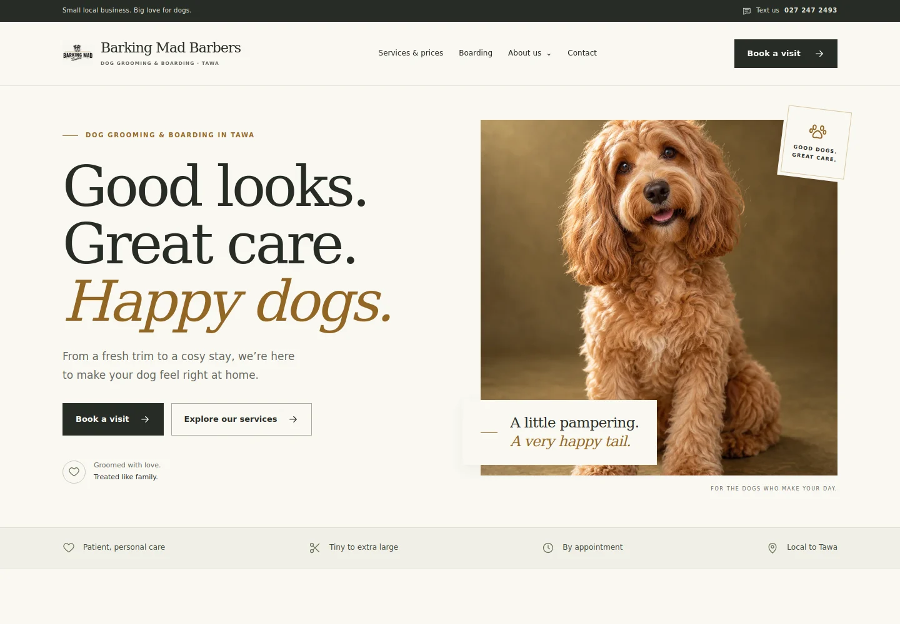

# Barking Mad Barbers remaster

The site has been rebuilt with cream, charcoal, sage and gold, clear square-edged panels, editorial typography, a new decorative dog portrait and the original family photographs. All public pages share the design system.

[Full homepage](remaster-full-page.webp) · [Mobile preview](remaster-mobile.webp)

## Customer journeys

- Services show all five dog sizes, a live price comparison and links that carry the chosen service and size into the enquiry form.
- Grooming enquiries support multiple dogs, individual services and estimates. Selecting a full groom and a wash cannot double-charge; included extras remain free.
- Boarding enquiries start with boarding selected, ask for care details, and validate the stay dates in New Zealand time.
- Review shows the exact message before opening SMS. It makes clear that the team must confirm an appointment and final price.
- Text enquiries include a copy fallback. Photo submissions prepare an email, with photos attached in the customer’s email app.
- Saved contact details remain compatible with the old version and are opt-in. Unavailable browser storage does not block booking.

## Verification

- 11 automated tests cover published prices, included extras, package deduplication, multiple dogs, incomplete inputs, message contents, NZ dates, SMS encoding, route matching and HTML escaping.
- Browser checks passed for 13 routes at 1440, 768, 390 and 320 pixels: no horizontal overflow, duplicate IDs or missing image alt attributes; one H1 per page.
- Complete grooming and boarding journeys were exercised, including required fields, invalid email, date order, removing dogs, switching packages and SMS preview links.
- Saved-details persistence, contact message preparation, keyboard Escape navigation, FAQ disclosure, blocked storage and no-JavaScript contact fallbacks were checked.
- No uncaught browser errors were recorded. Desktop and mobile screenshots were visually reviewed.
- `npm run build`, `npm test`, script syntax checks and `git diff --check` pass.

Browser verification used Chromium 133 on Linux with the viewport sizes above. SMS/email links and prepared messages were verified without sending a real customer message. Opening a native messaging app on a physical iPhone or Android device was not tested.

## Delivery

The existing custom domain and GitHub Pages deployment are retained. Each route now has its own generated HTML, including the missing boarding route; no application-server fallback is needed. Page-specific metadata, a sitemap, a 404 and structured business data are included. Original assets remain in the repository.

The new primary portrait is about 130 KB; its mobile version is about 42 KB. The previous 2.9 MB advert is retained as an asset but is no longer downloaded as the hero. Runtime dependencies and external font requests are not required.
